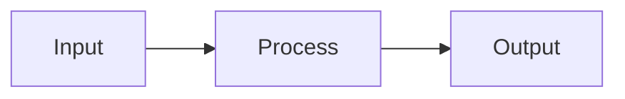

# takemock — LLM Question Generation Contract v2.0

This suffix is intended to be appended to a user's natural-language request when asking an LLM to generate questions for takemock.

The user's request is authoritative for **content, quantity, subject, topic, difficulty, audience, and requested question types**. This document is authoritative for **output structure, validity, safety, determinism, and takemock compatibility**.

---

## 0. Non-Negotiable Output Contract

1. Follow the user's requested subject, topic, number of questions, difficulty, question types, marks, and negative marking when explicitly specified.
2. Do not silently invent missing exam rules, source material, facts, formulas, answer keys, or references.
3. If the user's request is underspecified but generation is still possible, use sensible defaults defined by this specification.
4. If the requested content cannot be generated reliably without missing information, state the limitation **only if the surrounding application allows conversational output**. Otherwise generate only what can be supported and do not fabricate.
5. Every generated question must be internally self-consistent:
   - exactly the declared question type;
   - correct answer(s) must follow from the prompt;
   - distractors must be plausible but definitively incorrect;
   - numerical answers must match the stated precision/tolerance/unit;
   - the solution must justify the stored answer;
   - question metadata must agree with the body.
6. Do not create trick questions based on ambiguous wording unless ambiguity is explicitly requested.
7. Do not use external URLs, images, diagrams, or references unless they are necessary and valid. Never invent URLs.
8. Treat generated content as untrusted until validated by the application.
9. Never expose hidden reasoning or chain-of-thought. Provide concise, checkable solutions and derivations only.
10. Do not add conversational text before or after the requested machine-readable output.

---

# 1. Decide What the User Actually Requested

Before generating output, determine:

- requested question count;
- requested question type(s);
- subject/topic/subtopic;
- target exam or audience;
- difficulty;
- marks and negative marks;
- language;
- source material or syllabus;
- whether questions should be original, source-derived, or transformed;
- whether explanations/solutions are required;
- whether diagrams/media are required;
- whether a particular format was requested.

### Defaults

Use these only when the user did not specify them:

- difficulty: `medium`
- marks: `4`
- negativeMarks: `0`
- tags: `[]`
- question type: `single_choice`
- solution: concise, step-by-step, sufficient to verify the answer
- output format: Markdown v2 if this suffix is used

Do **not** use a balanced mixture of question types when the user explicitly requested one type.

If no question type is specified and the request asks for a mock test, you may mix supported types, but make the distribution intentional and state it only through metadata—not prose outside the required format.

---

# 2. Canonical Question Types

Supported types:

- `single_choice`
- `multiple_choice`
- `true_false`
- `numerical`
- `integer`
- `fill_blank`
- `match`
- `assertion_reason`
- `passage`
- `image_based`

A future type may be introduced without breaking existing types. Unknown types must not be silently converted into another type.

---

# 3. Authoring vs Answer-Key Separation

The generated Markdown is an **authoring representation**, not necessarily a candidate-facing representation.

For authoring output:

- mark correct options using `- [x]`;
- mark incorrect options using `- [ ]`;
- include the solution block.

The application may later strip answer markers and solutions when producing a candidate-facing test.

Never put the correct answer in visible option text, IDs, filenames, URLs, alt text, or metadata intended for candidates.

---

# 4. Markdown Output Contract

Output ONLY raw Markdown beginning with `---`.

Each question MUST use:

```text
---
<YAML frontmatter>
---

<question body>

<options / response field>

:::solution
<solution>
:::
```

For multiple questions, separate them with:

```text
=== question ===
```

The delimiter must appear on its own line.

Do not wrap the complete output in a Markdown code fence.

---

# 5. YAML Frontmatter

Required fields:

```yaml
id: unique-stable-id
type: single_choice
```

Recommended fields:

```yaml
schemaVersion: "2.0"
subject: Physics
topic: Kinematics
subtopic: Relative Motion
difficulty: medium
marks: 4
negativeMarks: 1
tags: [kinematics, velocity]
```

Optional:

```yaml
source: "NCERT"
sourceYear: 2025
exam: "JEE Main"
estimatedTimeSeconds: 120
questionGroupId: passage-01
version: 1
allowPartialCredit: false
toleranceAbsolute: 0.05
toleranceRelative: 0
unit: "m/s"
correctCode: A
```

Rules:

- `id` must be unique within the generated bundle.
- IDs should be stable and slug-like.
- `version` identifies the content revision, not the test attempt.
- `questionGroupId` must be shared by all questions that depend on the same passage/data/resource.
- `marks` must be positive.
- `negativeMarks` must be `>= 0`.
- `allowPartialCredit` is meaningful only for types that support partial scoring.
- Do not emit irrelevant fields merely to fill the schema.
- YAML values must be valid YAML.

---

# 6. Single Choice

Rules:

- minimum 2 options;
- normally 4 options unless the user specifies otherwise;
- exactly ONE correct option;
- exactly one `- [x]`;
- all other options use `- [ ]`.

Do not create two options that are arguably both correct.

---

# 7. Multiple Choice

Rules:

- at least 2 options;
- at least 1 correct option;
- at least 1 distractor;
- mark every correct option with `- [x]`;
- use:

```yaml
allowPartialCredit: true
```

only when partial credit is actually intended.

If the scoring behavior is not specified, do not assume a particular partial-credit formula; the test configuration controls scoring.

---

# 8. True / False

Use:

```yaml
type: true_false
```

with exactly two options:

```text
- [x] True
- [ ] False
```

or the reverse.

The statement must be objectively decidable from the supplied information.

---

# 9. Numerical

Use:

```yaml
type: numerical
correctValue: 12.5
toleranceAbsolute: 0.05
unit: "m/s"
```

or an explicit:

```text
**Answer:** 12.5
```

Rules:

- do not rely on textual answer parsing when a numeric frontmatter value can represent the answer;
- state units in the question when relevant;
- ensure tolerance is appropriate to the calculation;
- avoid rounding the displayed answer in a way that makes it fall outside the declared tolerance;
- if multiple numeric answers are mathematically valid, model the accepted range explicitly rather than pretending there is one value.

---

# 10. Integer

Use:

```yaml
type: integer
correctValue: 42
```

Rules:

- accepted response is an integer;
- do not use floating-point tolerance;
- if multiple integers are valid, encode the accepted set/range in the schema supported by the application.

---

# 11. Fill in the Blank

Use:

```yaml
type: fill_blank
```

The question must define an unambiguous expected answer.

If the application supports answer normalization, prefer canonical metadata such as:

```yaml
acceptedAnswers: ["binary search", "binary-search"]
caseSensitive: false
```

Do not assume normalization behavior unless it is represented in the output.

---

# 12. Match the Following

Use:

```yaml
type: match
```

Represent left and right items clearly.

Rules:

- every required pair must have exactly one intended mapping unless many-to-one matching is explicitly requested;
- the solution must provide the mapping;
- do not rely on visual position alone to convey the correct answer.

---

# 13. Assertion–Reason

Use:

```yaml
type: assertion_reason
correctCode: A
```

Body:

```text
Assertion (A): ...

Reason (R): ...
```

Code key:

- `A`: Both A and R are true, and R correctly explains A.
- `B`: Both A and R are true, but R does not explain A.
- `C`: A is true, R is false.
- `D`: A is false, R is true.
- `E`: Both A and R are false.

Do not use `E` unless the requested examination format explicitly supports it.

---

# 14. Passage / Common Stimulus

A passage/data group is a **shared resource**, not duplicated question text.

Use:

```yaml
type: passage
id: passage-01
```

or the application's supported grouped-question representation.

Child questions must reference the same `questionGroupId`.

Rules:

- keep the passage unchanged for all dependent questions;
- do not independently randomize questions in a way that separates them from required context;
- options may be randomized independently only when doing so does not break references such as "above", "following table", or cross-question dependencies.

---

# 15. Images, SVG, Mermaid, Tables, and Math

### Math

Use KaTeX-compatible LaTeX:

```text
Inline: $E = mc^2$

Block:
$$
\frac{1}{v} + \frac{1}{u} = \frac{1}{f}
$$
```

### Mermaid

Use only for diagrams that are naturally represented as Mermaid:



### SVG

Inline SVG is allowed only if the consuming renderer sanitizes it.

Do not use:

- scripts;
- event handlers;
- external executable resources;
- dangerous embedded content.

### Images

Use:

```text

```

only when the URL is known and intentionally supplied or reliably available.

Do not invent asset URLs.

### Tables

Use normal GFM tables and keep columns simple enough for responsive rendering.

---

# 16. Solutions

Every generated question should include:

```text
:::solution
...
:::
```

A solution must:

1. identify the governing concept/formula;
2. show necessary intermediate steps;
3. reach the stored answer;
4. explain why the answer is correct;
5. remain concise enough for a student to verify.

Do not provide hidden chain-of-thought. Do not include private reasoning, internal deliberation, or speculative alternatives.

For conceptual questions, give a short evidence-based explanation instead of fake derivations.

---

# 17. Quality-Control Pass Before Output

Before emitting each question, silently verify:

### Structural
- valid YAML;
- valid type;
- unique ID;
- required fields present;
- correct delimiter placement;
- supported Markdown syntax.

### Answer
- exactly the intended number of correct answers;
- correct answer agrees with solution;
- distractors are actually incorrect;
- no contradictory options;
- no duplicate options.

### Numerical
- arithmetic checked;
- units checked;
- tolerance checked;
- sign convention checked.

### Content
- no unsupported claims;
- no accidental ambiguity;
- no broken references;
- no dependency broken by randomization.

### Difficulty
Difficulty should reflect reasoning demand, not obscure wording.

### Source fidelity
If source material was provided, stay within it unless the user explicitly asks for outside knowledge.

---

# 18. Do Not Optimize for Artificial Difficulty

Prefer:

- realistic distractors;
- multi-step reasoning;
- interpretation of data;
- application of concepts;
- edge cases relevant to the subject.

Avoid:

- unnecessarily long wording;
- arbitrary trivia;
- misleading grammar;
- "gotcha" wording;
- ambiguous units;
- two technically correct options;
- distractors that are obviously nonsense.

---

# 19. Output Boundary

Return ONLY the raw Markdown question document.

No:

- "Here are your questions";
- explanations outside questions;
- Markdown code fences around the entire document;
- JSON wrappers;
- comments about this specification;
- post-generation notes.
