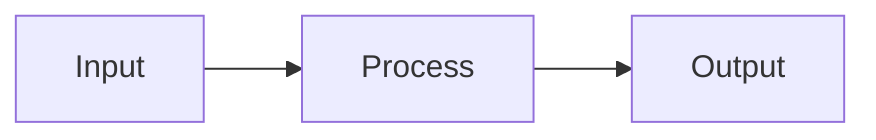

# takemock — Canonical Markdown Question Specification v2.0

This is the canonical authoring format for takemock question files.

The format is designed for:

- human authoring;
- Git/version control;
- LLM generation;
- deterministic parsing;
- question-bank storage;
- rendering in CBT, practice, and review modes;
- conversion to/from JSON;
- future question types without breaking existing content.

The parser MUST validate the document before importing it.

---

# 1. Document Model

A question file is:

```text
<Question>
=== question ===
<Question>
=== question ===
...
```

A question contains:

1. YAML frontmatter;
2. question body;
3. optional response/options;
4. optional solution.

Canonical shape:

```markdown
---
schemaVersion: "2.0"
id: phy-kin-001
type: single_choice
subject: Physics
topic: Kinematics
difficulty: medium
marks: 4
negativeMarks: 1
tags: [kinematics]
---

Question text.

- [ ] Option A
- [x] Option B
- [ ] Option C
- [ ] Option D

:::solution
Explanation and derivation.
:::
```

---

# 2. Parsing Rules

## 2.1 Question boundary

The exact delimiter is:

```text
=== question ===
```

It must occupy an entire line.

Leading/trailing whitespace around the delimiter may be normalized by the parser.

The delimiter MUST NOT be interpreted as a question boundary inside:

- fenced code blocks;
- YAML;
- HTML/SVG;
- solution blocks.

## 2.2 Frontmatter

Frontmatter starts with `---` immediately before the question metadata and ends at the next standalone `---`.

The parser MUST reject malformed YAML instead of attempting heuristic recovery.

## 2.3 Markdown body

Question content uses GitHub-Flavored Markdown plus the extensions documented here.

---

# 3. Versioning

Every newly authored document SHOULD use:

```yaml
schemaVersion: "2.0"
```

Importers MUST support explicit version migration.

A schema version identifies the **document format**, not the question content version.

A question's:

```yaml
version: 3
```

identifies the revision of that question.

Do not mutate an already-submitted question in a way that changes historical scoring. Attempts must retain or reference an immutable question snapshot/version.

---

# 4. Frontmatter

| Field | Type | Required | Default | Applies to |
|---|---|---:|---|---|
| `schemaVersion` | string | No | `"2.0"` | all |
| `id` | string | Yes | — | all |
| `version` | integer | No | `1` | all |
| `type` | enum | Yes | — | all |
| `subject` | string | No | `General` | all |
| `topic` | string | No | `General` | all |
| `subtopic` | string | No | undefined | all |
| `difficulty` | enum | No | `medium` | all |
| `marks` | number | No | `4` | scored |
| `negativeMarks` | number | No | `0` | scored |
| `tags` | string[] | No | `[]` | all |
| `source` | string | No | undefined | all |
| `sourceYear` | integer | No | undefined | all |
| `exam` | string | No | undefined | all |
| `estimatedTimeSeconds` | number | No | undefined | all |
| `questionGroupId` | string | No | undefined | grouped |
| `allowPartialCredit` | boolean | No | false | compatible types |
| `toleranceAbsolute` | number | No | `0` | numerical |
| `toleranceRelative` | number | No | `0` | numerical |
| `unit` | string | No | undefined | numerical |
| `correctCode` | enum | No | undefined | assertion_reason |
| `correctValue` | number | No | undefined | numerical/integer |
| `acceptedAnswers` | string[] | No | undefined | fill_blank |
| `caseSensitive` | boolean | No | implementation-defined | fill_blank |

Unknown fields SHOULD be preserved as extension metadata when namespaced, for example:

```yaml
x-myApp:
  difficultyModel: "custom-v1"
```

Unknown unnamespaced fields SHOULD generate a validation warning.

---

# 5. Question Types

Required parser support:

```text
single_choice
multiple_choice
true_false
numerical
integer
fill_blank
match
assertion_reason
passage
image_based
```

The architecture MUST use a registry/factory model so new types can be added without changing the core attempt engine.

---

# 6. Single Choice

Example:

```markdown
---
id: q1
type: single_choice
---

Which data structure uses FIFO ordering?

- [x] Queue
- [ ] Stack
- [ ] Heap
- [ ] Tree
```

Validation:

- >= 2 options;
- exactly one correct option;
- no duplicate option text after normalization.

---

# 7. Multiple Choice

```markdown
---
id: q2
type: multiple_choice
allowPartialCredit: true
---

Which are linear data structures?

- [x] Array
- [x] Queue
- [ ] Tree
- [x] Stack
```

Validation:

- >= 2 options;
- >= 1 correct;
- >= 1 incorrect;
- partial-credit behavior is controlled by the test scoring policy.

The question format must not hard-code a partial-credit formula.

---

# 8. True / False

```markdown
---
id: q3
type: true_false
---

A queue follows FIFO ordering.

- [x] True
- [ ] False
```

Exactly two options are required.

---

# 9. Numerical

Canonical:

```markdown
---
id: q4
type: numerical
correctValue: 1.0472
toleranceAbsolute: 0.0005
unit: rad
---

Find the principal value of $\theta$ satisfying:

$$
\sin(\theta)=\frac{\sqrt3}{2}
$$

:::solution
...
:::
```

The parser MUST reject a numerical question if it has neither:

- `correctValue`, nor
- an explicitly supported answer field.

Relative tolerance may be used for values whose scale makes absolute tolerance inappropriate.

---

# 10. Integer

```markdown
---
id: q5
type: integer
correctValue: 42
---

How many edges are present in a complete graph $K_7$?
```

Integer questions must not silently accept decimal values.

---

# 11. Fill in the Blank

Canonical representation:

```markdown
---
id: q6
type: fill_blank
acceptedAnswers:
  - binary search
  - binary-search
caseSensitive: false
---

The algorithm that searches a sorted array by repeatedly halving the search space is ______.
```

The application may implement answer normalization, but normalization rules must be explicit and testable.

---

# 12. Match

Recommended authoring representation:

```markdown
---
id: q7
type: match
---

Match each algorithm with its typical complexity.

| Left | Right |
|---|---|
| Binary search | $O(\log n)$ |
| Linear search | $O(n)$ |
| Merge sort | $O(n\log n)$ |

:::answer
Binary search -> $O(\log n)$
Linear search -> $O(n)$
Merge sort -> $O(n\log n)$
:::
```

If the application needs a fully machine-readable mapping, it SHOULD use a structured `matches` field in a JSON representation and treat Markdown as the human-facing serialization.

---

# 13. Assertion–Reason

```markdown
---
id: q8
type: assertion_reason
correctCode: A
---

Assertion (A): ...

Reason (R): ...

Options:

- [x] A
- [ ] B
- [ ] C
- [ ] D
- [ ] E
```

Code key:

- A — both true and R explains A
- B — both true but R does not explain A
- C — A true, R false
- D — A false, R true
- E — both false

The actual code key should be configurable by the test/exam format when different conventions are required.

---

# 14. Passage / Shared Stimulus

A shared stimulus should be modeled as a group.

Recommended:

```markdown
---
id: passage-001
type: passage
questionGroupId: passage-001
---

## Passage

<shared passage/data/table/diagram>

### Question 1

...
```

If the implementation stores child questions as independent records, each child must contain:

```yaml
questionGroupId: passage-001
```

The test engine must treat the group as an atomic dependency when ordering/randomizing.

---

# 15. Rich Content

## 15.1 Math

Use KaTeX-compatible syntax:

```text
$E=mc^2$

$$
\int_0^1 x^2\,dx=\frac13
$$
```

The renderer, not the parser, is responsible for visual math rendering.

## 15.2 Mermaid



Mermaid must be sanitized or rendered in a sandbox appropriate to the deployment environment.

## 15.3 SVG

Inline SVG is allowed, but imported content MUST be sanitized.

Reject or strip:

- `<script>`;
- event-handler attributes such as `onclick`;
- unsafe external references;
- executable content.

## 15.4 Images

```markdown

```

The importer should preserve the URL but should not assume it will remain available.

For long-term reliability, question assets SHOULD support managed asset IDs or content-addressed storage.

---

# 16. Tables

Use GFM tables.

```markdown
| Year | Revenue |
|---:|---:|
| 2024 | 120 |
| 2025 | 145 |
```

Tables are content, not scoring metadata.

---

# 17. Solutions and Answer Data

Solutions are authoring/review content.

```markdown
:::solution
Step 1: ...
Step 2: ...
Therefore, the answer is ...
:::
```

The parser should preserve the solution as a separate field.

Candidate-facing renderers SHOULD be able to omit solutions entirely.

Solutions MUST NOT be used as the sole source of truth for automated scoring when structured answer metadata exists.

---

# 18. Media and External Dependencies

Question content may reference external assets, but production systems should prefer managed assets.

A question should remain identifiable even if an external image becomes unavailable.

Recommended future metadata:

```yaml
assets:
  - id: asset-circuit-01
    type: image
```

The exact syntax can be implemented through a future schema extension.

---

# 19. Question Identity and Versioning

`id` identifies the logical question.

`version` identifies a specific content revision.

Example:

```text
question id: phy-001
version: 1
version: 2
version: 3
```

An attempt MUST reference the exact question version/snapshot used at delivery.

Changing the question text, options, correct answer, marks, or scoring-relevant metadata SHOULD create a new version rather than modifying historical content in place.

---

# 20. Validation Levels

Implement three levels:

### Error
Import must fail.

Examples:

- malformed YAML;
- missing `id`;
- missing `type`;
- invalid type;
- duplicate question ID;
- multiple correct answers in `single_choice`;
- numerical question without answer;
- malformed question boundary.

### Warning
Import may continue.

Examples:

- unknown optional metadata;
- missing topic;
- external asset;
- unusually long question;
- missing solution.

### Info
Non-blocking authoring guidance.

Examples:

- no tags;
- no difficulty;
- unusually short distractors.

---

# 21. Deterministic Parsing

The same Markdown document MUST produce the same normalized question representation.

Do not use:

- random IDs during parsing;
- current timestamps as content values;
- network calls required to parse a question;
- heuristic answer inference when explicit metadata exists.

---

# 22. Canonical Normalization

The importer should normalize:

- line endings;
- frontmatter key ordering;
- whitespace where semantically irrelevant;
- option IDs;
- tags;
- numeric values.

It MUST NOT normalize away meaningful content such as:

- mathematical whitespace where it affects LaTeX;
- code;
- table structure;
- case when `caseSensitive: true`.

---

# 23. Security

Treat imported Markdown as untrusted input.

The renderer MUST sanitize:

- HTML;
- SVG;
- URLs;
- embedded media;
- Mermaid;
- links.

Never allow question content to execute arbitrary JavaScript.

External URLs should be subject to:

- scheme allowlist (`https`, optionally `http`);
- CSP;
- safe target behavior;
- optional proxying/caching.

---

# 24. Compatibility

The Markdown format is the human-friendly representation.

The internal canonical model should be richer than Markdown when necessary.

Recommended pipeline:

```text
Markdown
   ↓
Parser
   ↓
Validation
   ↓
Normalized Question Model
   ↓
Database / Question Bank
   ↓
Test Builder
   ↓
Test Snapshot
   ↓
Attempt Engine
```

Do not make the runtime CBT engine parse Markdown directly for every question.

---

# 25. Conversion Contract

Markdown ↔ JSON conversion must preserve, where representable:

- question identity;
- version;
- type;
- metadata;
- body;
- options;
- correct answer;
- scoring metadata;
- numerical tolerance;
- answer mappings;
- group relationships;
- solution;
- media references.

If information cannot be represented losslessly, the converter MUST report it instead of silently dropping it.

---

# 26. Example Complete File

```markdown
---
schemaVersion: "2.0"
id: cs-os-001
version: 1
type: single_choice
subject: Computer Science
topic: Operating Systems
difficulty: medium
marks: 2
negativeMarks: 0.5
tags: [os, virtual-memory]
estimatedTimeSeconds: 90
---

What is the primary purpose of virtual memory?

- [x] To provide an abstraction of a larger address space than physical RAM
- [ ] To permanently increase the capacity of physical RAM
- [ ] To replace the CPU cache
- [ ] To improve monitor resolution

:::solution
Virtual memory provides processes with a virtual address space that can exceed the amount of physical RAM. The operating system and hardware map virtual pages to physical memory and, when necessary, secondary storage.
:::
```

---

# 27. Parser/Engine Boundary

The Markdown specification defines **content representation**.

It does NOT define:

- test timing;
- navigation;
- scoring formulas;
- question selection;
- multiplayer;
- analytics;
- authentication;
- authorization.

Those belong to the test/attempt platform configuration and runtime.

This separation is intentional: a question should be reusable across many test configurations.

